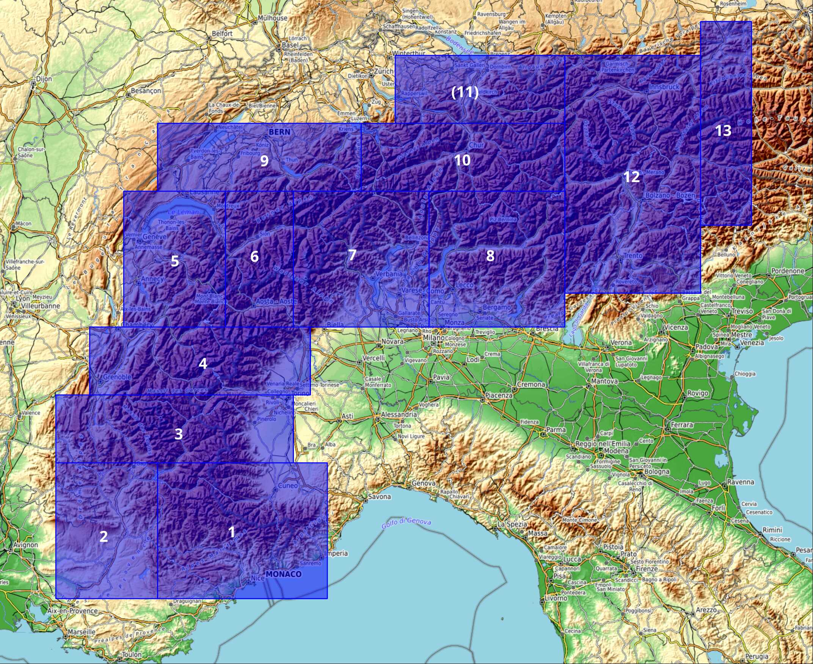

# eTopo: Enhanced topo maps

The main aim of this project is to build **topo map mashups** for the alps, mixing the best data sources available.

The output is divided between the following areas:

*(here is the corresponding [etopo_alps_extents.geojson])*

| Area      | Sources                  |
| --        | -                        |
| 1,3,4     | IGN, Bugianen            |
| 2         | IGN                      |
| 5         | IGN, Bugianen, SwissTopo |
| 6         | Bugianen, SwissTopo      |
| 8         | SwissTopo                |
| 7,9,10    | SwissTopo, Kompass       |
| 12        | Kompass                  |

---

This repo contains the following folders:

### `src`

Supporting code, from low- to higher-level dependencies.

* [img_util.py](src/img_util.py): detecting partial tiles ; merging them ; and "tiling" them
* [mbt_pyramid.py](src/mbt_pyramid.py): assemble mbtiles samples at each zoom-level in a grid
* [mbt_download.py](src/mbt_download.py): download tiles, possibly into mbtiles
* [mbt_partial.py](src/mbt_partial.py): massive cleanup of mbtiles using the above

⚠️ This code depends on [eslope libs], which are not packaged.

### topo compare

Visual comparison of different topo maps covering overlapping areas.

* [topomap-calps-pyramids.ipynb]: on central-alps, with a wider array of maps incl. kompass.
* [topomap-fr-pyramids.ipynb]: focused on western alps, IGN, SwissTopo
* [topomap-lowzoom.ipynb]: focused on z5-9

### topo merge

Merge different topo maps to play to the strengh of each, in order to eventually cover most of the alps.
The tile download is usually done with external tools (MOBAC).

<!-- * [202012-Offline-SwissTopo.md] -->
* [SwissTopo.ipynb]: download SwissTopo base layer, starting with downsampled tiles and filling missing data with the "big" tiles. These 4 explain some of the code used:
  + [SwissTopo-1-explore-downsample.ipynb]: How to download already downsampled tiles
  + [SwissTopo-2-explore-api.ipynb]: Why we use WMTS API
  + [SwissTopo-3-explore-partial-detect.ipynb]: how to detect partial tiles ie missing part of the image.
  + [SwissTopo-4-explore-partial-merge]: how to fill missing content in a tile.
* [SwissTopo-2023-cut.ipynb]: Split of the merged file above into TMSz9 zones 5/6/7 (south) and 8/9 (center)
* [202111-Bugianen-merge.ipynb]: tiny one, to merge all Bugianen mbtiles maps
* [merge_frit1.ipynb]: merge of french IGN maps and Italian Bugianen map across the border. Notebooks frit1/3/4 are almost identical, while [merge_frit5_mb.ipynb] is not.

### topo other

* [202111-piemonte-CTR-steep-only.ipynb]: An abandoned experiment to see if I could extract only cliff contours from the Italina piemonte CTR _(Carta Tecnica Regionale)_. Not conclusive, but kept for the scikit-image examples.

_Note: Notebook links use the great nbviewer.org_

<!-- Links: -->
[etopo_alps_extents.geojson]:./data/areas/etopo_alps_extents.geojson
[eslope libs]:https://github.com/eslopemap/eslope/tree/main/development/src
[topomap-calps-pyramids.ipynb]:https://nbviewer.org/github/eslopemap/etopo/blob/main/topo_compare/topomap-calps-pyramids.ipynb
[topomap-fr-pyramids.ipynb]:https://nbviewer.org/github/eslopemap/etopo/blob/main/topo_compare/topomap-fr-pyramids.ipynb
[topomap-lowzoom.ipynb]:https://nbviewer.org/github/eslopemap/etopo/blob/main/topo_compare/topomap-lowzoom.ipynb
[202012-Offline-SwissTopo.md]:topo_download/202012-Offline-SwissTopo.md
[202111-Bugianen-merge.ipynb]:https://nbviewer.org/github/eslopemap/etopo/blob/main/topo_download/202111-Bugianen-merge.ipynb
[SwissTopo.ipynb]:https://nbviewer.org/github/eslopemap/etopo/blob/main/topo_download/SwissTopo.ipynb
[202102-Alps-Topo.md]:https://nbviewer.org/github/eslopemap/etopo/blob/main/
[SwissTopo-1-explore-downsample.ipynb]:https://nbviewer.org/github/eslopemap/etopo/blob/main/topo_merge/SwissTopo-1-explore-downsample.ipynb
[SwissTopo-2-explore-api.ipynb]:https://nbviewer.org/github/eslopemap/etopo/blob/main/topo_merge/SwissTopo-2-explore-api.ipynb
[SwissTopo-3-explore-partial-detect.ipynb]:https://nbviewer.org/github/eslopemap/etopo/blob/main/topo_merge/SwissTopo-3-explore-partial-detect.ipynb
[SwissTopo-4-explore-partial-merge]:https://nbviewer.org/github/eslopemap/etopo/blob/main/topo_merge/SwissTopo-4-explore-partial-merge
[202111-piemonte-CTR-steep-only.ipynb]:https://nbviewer.org/github/eslopemap/etopo/blob/main/topo_other/202111-piemonte-CTR-steep-only.ipynb
[merge_frit1.ipynb]: [https://nbviewer.org/github/eslopemap/etopo/blob/main/topo_merge/merge_frit1.ipynb]
[merge_frit5_mb.ipynb]: [https://nbviewer.org/github/eslopemap/etopo/blob/main/topo_merge/merge_frit5_mb.ipynb]

